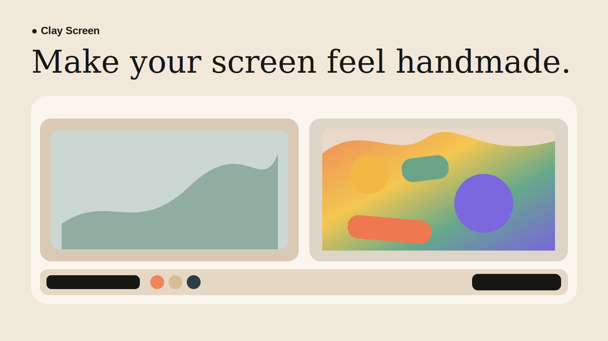

# Clay Screen

Turn a screen, camera, or video into a responsive handmade world with
[FLUX.2 [klein] Realtime](https://fal.ai/models/fal-ai/flux-2/klein/realtime).



[Interface preview](https://evnsnclr.github.io/clay-screen/) ·
[Research and build notes](RESEARCH_AND_BUILD_PLAN.md) ·
[Validation receipt](VALIDATION.md)

The GitHub Pages site is intentionally an **interface preview**: it does not
run AI. Deploy the static app and its small token function to Vercel, or run
the FastAPI mirror locally, for real FLUX.2 generation.

## Cloud quickstart

You need a [fal API key](https://fal.ai/dashboard/keys) and a private access code
of your choice.

```bash
git clone https://github.com/evnsnclr/clay-screen.git
cd clay-screen
python3 -m venv .venv
source .venv/bin/activate
pip install -r requirements-local.txt
cp .env.example .env.local
```

Fill in `.env.local`, then launch:

```bash
./run_preview.sh
```

Open [http://127.0.0.1:7860](http://127.0.0.1:7860), enter the same access
code, choose a source, and press **Start transforming**.

### Deploy to Vercel

[](https://vercel.com/new/clone?repository-url=https%3A%2F%2Fgithub.com%2Fevnsnclr%2Fclay-screen&env=FAL_KEY%2CCLAY_SCREEN_ACCESS_CODE)

1. Import this repository at [vercel.com/new](https://vercel.com/new).
2. Add `FAL_KEY` and `CLAY_SCREEN_ACCESS_CODE` as encrypted environment
   variables for Production and Preview.
3. Deploy. There is no frontend build: Vercel serves the static interface and
   the two small JavaScript functions under `api/`.
4. Share the site and access code only with people whose usage you intend to
   fund.

The access code protects the token endpoint; `FAL_KEY` never enters browser
JavaScript. It is a shared-secret billing boundary, not per-user authentication
or a hard spending limit. The app ends a normal generation session after 60
seconds, but an authorized or modified client can start another. Start with a
small prepaid balance, disable automatic recharge if your account offers it,
and review the billing controls actually available to your fal account before
sharing broadly.

As listed on July 15, 2026, fal prices this endpoint at
**$0.00194 per compute-second**. Check the
[current model page](https://fal.ai/models/fal-ai/flux-2/klein/realtime) before
launching a public demo.

## What leaves the device

Cloud mode resizes selected browser-capture frames and sends them directly to
fal over a realtime WebSocket. fal returns generated frames for the browser to
draw and optionally record. The token function supplies only short-lived,
endpoint-scoped credentials; it does not proxy the image stream.

Treat screen sharing as disclosure to a third-party processor. Do not select a
window containing private information, and review
[fal's payload documentation](https://fal.ai/docs/documentation/model-apis/inference/payloads)
before deployment.

## How it works

```text
browser-approved screen, camera, or video
        │ resized JPEG frames
        ▼
fal realtime WebSocket → FLUX.2 [klein] → generated canvas
        ▲
short-lived token after access-code check
```

The browser keeps only one fresh frame in flight, uses a fixed seed and output
feedback for continuity, and closes the connection on stop, error, page exit,
or the 60-second cap.

## Optional private Mac fallback

The existing SD-Turbo path still runs entirely on an Apple Silicon Mac. It is
slower and substantially less faithful than FLUX.2, but requires no cloud key
and sends no frames off-device.

Requirements:

- Apple Silicon (M1–M4 or newer)
- macOS 14 or newer
- Python 3.10 or newer
- about 6 GB free for the one-time model download

```bash
./setup_mac.sh
./run_mac.sh
```

Open [http://127.0.0.1:7860](http://127.0.0.1:7860). The first generated frame
downloads SD-Turbo and TAESD and warms the pipeline; later launches reuse the
Hugging Face cache. The local path uses 512×288 inputs and a two-timestep
StreamDiffusion batch through PyTorch MPS. On the development Mac (`Mac16,5`,
48 GB), warm model calls took 103–136 ms; performance varies by Mac.
Leave `FAL_KEY` and `CLAY_SCREEN_ACCESS_CODE` blank in `.env.local` when you
want the local path to be selected.

## Interface-only preview

```bash
python3 -m venv .venv
source .venv/bin/activate
pip install -r requirements-local.txt
./run_preview.sh
```

Preview mode uses a labeled browser effect and is not presented as diffusion.

## Development

```bash
pip install -r requirements-dev.txt
npm ci
pytest -q
npm run check
npm test
```

The tests do not call fal or perform paid inference. A real-key smoke test is a
separate release gate documented in [VALIDATION.md](VALIDATION.md).

## Licenses and attribution

Clay Screen code is Apache-2.0 licensed. Cloud mode uses the MIT-licensed,
pinned `@fal-ai/client`, fal's hosted service, and FLUX.2 [klein] from Black
Forest Labs; their terms apply separately.
The optional local path installs StreamDiffusion-Mac, SD-Turbo, and TAESD,
whose model and dependency licenses also remain separate. See [NOTICE](NOTICE).

The visual direction was inspired by
[Ryan Stephen's realtime diffusion UI experiment](https://x.com/Ryan__Stephen/status/2066890410824528077).
Clay Screen is an independent implementation and does not reproduce the
original project's unpublished code or configuration.
