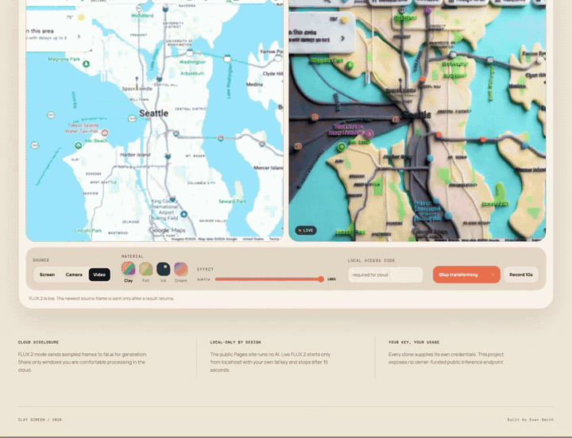

# Clay Screen

Turn a browser tab, camera, or video into a responsive handmade world with
[FLUX.2 [klein] Realtime](https://fal.ai/models/fal-ai/flux-2/klein/realtime).

[Watch the 23-second MP4](assets/clay-screen-demo.mp4) ·
[Validation receipt](VALIDATION.md) ·
[Research notes](RESEARCH_AND_BUILD_PLAN.md)

Clay Screen intentionally has no hosted AI app. Clone it, run it on localhost,
and supply your own fal key. There is no Vercel deployment, GitHub Pages demo,
or owner-funded public inference endpoint.

## Real FLUX.2 demo

[](assets/clay-screen-demo.mp4)

This is an actual FLUX.2 run recorded by Clay Screen—not a design mockup. The
video opens in **Live compare · smooth** so the moving source and displayed
output remain visible together across a scrolling gallery and several map
zooms, then finishes with a clean generated-only clay interface.

The showcase is a 22.89-second, 1920×1080 H.264 MP4 at a constant 29.97 fps.
It preserves the recorded timing: no speed ramp or post-production optical-flow
frames were added. This is an edited showcase rather than an exact-pair audit or
an inference-fps benchmark; see the [validation receipt](VALIDATION.md) for the
measured recorder evidence and the retained output-only validation take.

## Run locally

Requirements:

- Python 3.10 or newer
- macOS or Linux shell; native Windows is not currently tested
- a [fal API key](https://fal.ai/dashboard/keys) with a small available balance
- current Chrome for captured-tab scroll control; other modern browsers can use
  Demo, Camera, Video, or a side-by-side capture workflow

```bash
git clone https://github.com/evnsnclr/clay-screen.git
cd clay-screen
python3 -m venv .venv
source .venv/bin/activate
pip install -r requirements-local.txt
cp .env.example .env.local
chmod 600 .env.local
```

Put your own key and a private local access code in `.env.local`:

```dotenv
FAL_KEY=your_api_scoped_fal_key
CLAY_SCREEN_ACCESS_CODE=choose_a_private_local_code
```

Then run:

```bash
./run_demo.sh
```

Open [http://127.0.0.1:7860](http://127.0.0.1:7860). The fal key stays on the
local Python server; the browser receives only an endpoint-scoped, short-lived
realtime token.

## Get a good demo immediately

1. Choose **Demo** and **Clay** at 100%.
2. Enter the access code from `.env.local` and press **Start transforming**.
3. Leave **Recording** on **Live compare · smooth**, then press **Record**. It
   captures the continuously moving source beside the same interpolated output
   visible in the app.
4. Open the saved 1920×1080 comparison, or choose **Output · square** before
   recording for a clean 1080×1080 generated-only take. Use **Exact pairs ·
   audit** only when you need to inspect the precise native source/result pairs.

Recording is a manual toggle, not a fixed ten-second timer. It uses a dedicated
presentation canvas targeting 30 fps and requests up to 16 Mbps for landscape
modes. Live compare records the moving source and every displayed output update,
including RIFE interpolation; its footer shows the current output age so the
model delay is explicit. Exact-pair audit instead pairs the precise JPEG sent to
FLUX.2 with its unblended native result. That audit mode intentionally excludes
RIFE frames and will therefore look less fluid. Normalize the browser WebM below
before posting to guarantee a constant-frame-rate master.

## Transform and scroll a real browser tab

On desktop Chrome 136 or newer:

1. Choose **Browser tab** and select the tab you want to transform. Clay Screen
   excludes the current tab and whole-monitor capture to prevent recursion.
2. Start transforming, then click **Scroll captured tab**.
3. Grant Chrome's one-time captured-surface permission.
4. Keep the pointer over the generated output and scroll. Chrome forwards those
   wheel events to the captured tab while Clay Screen stays visible and keeps
   sampling.

This uses Chrome's
[Captured Surface Control API](https://developer.chrome.com/docs/web-platform/captured-surface-control).
If it is unavailable, keep Clay Screen and the source visible side by side.
Switching away can throttle browser timers and reduce responsiveness.

## Why scrolling now works

The first implementation waited for FLUX.2 to return before taking another
screenshot. Most scroll motion happened between requests and was never sent.
The current pipeline separates capture from inference:

```text
moving source
  → sample at 10 fps
  → retain only the newest waiting frame
  → one low-latency FLUX.2 request at a time
  → evenly pace the RIFE pair
  → generated canvas + 30 fps recording compositor
```

This latest-frame-wins design avoids both failure modes: it does not miss all
motion while waiting, and it does not build a costly queue of stale cloud work.
The diagnostics badge reports sampled fps, native result fps, displayed fps,
and p95 displayed-frame age during each live run.

## Normalize a browser recording

Chrome normally saves VP9 WebM with browser timestamps. Convert the default
1920×1080 live comparison to a constant-frame-rate, seekable MP4 before posting:

```bash
ffmpeg -i clay-screen-live.webm \
  -vf "fps=30,scale=1920:1080:flags=lanczos" \
  -c:v libx264 -crf 18 -preset slow -pix_fmt yuv420p \
  -movflags +faststart -an clay-screen-live.mp4
```

For **Output · square**, change both dimensions back to `1080:1080`.

Do not use frame-rate conversion to hide a poor live run. The built-in badge
and the validation receipt distinguish encoded cadence from actual generated
cadence.

## Privacy and cost boundary

FLUX.2 mode sends the selected JPEG frames directly to fal over a realtime
WebSocket. The local FastAPI server supplies the short-lived token; it does not
receive, proxy, or intentionally store the frames. Share only content you are
comfortable sending to a third-party processor.

Each normal cloud session stops after 15 seconds. At the price listed on July
16, 2026—$0.00194 per compute-second—the maximum rate-times-cap estimate is
about **$0.029 per session**. The access code and timer are local safety rails,
not account-level spending limits; a user can start another session. Keep a
small fal balance and recheck the
[current model page](https://fal.ai/models/fal-ai/flux-2/klein/realtime).

Every clone supplies its own credentials. Never deploy this token endpoint
publicly with your personal key unless you add real authentication, rate
limits, and an account-level budget.

## Optional private Mac fallback

The existing SD-Turbo fallback runs entirely on Apple Silicon. It is slower and
less faithful than FLUX.2, but sends no frames off-device:

```bash
./setup_mac.sh
./run_mac.sh
```

It requires macOS 14+, Apple Silicon, and about 6 GB for the one-time model
download. Leave `FAL_KEY` and `CLAY_SCREEN_ACCESS_CODE` blank when using it.

## Development

```bash
pip install -r requirements-dev.txt
npm ci
pytest -q
npm run check
npm test
```

CI uses mocks, leaves `FAL_KEY` unset, and never performs paid inference.

## License and attribution

Clay Screen code is Apache-2.0 licensed. FLUX.2 mode uses the MIT-licensed,
pinned `@fal-ai/client`, fal's hosted service, and FLUX.2 [klein] from Black
Forest Labs; their terms apply separately. See [NOTICE](NOTICE).

The visual direction was inspired by
[Ryan Stephen's realtime diffusion UI experiment](https://x.com/Ryan__Stephen/status/2066890410824528077).
Clay Screen is an independent implementation and does not reproduce the
original project's unpublished code or configuration.
