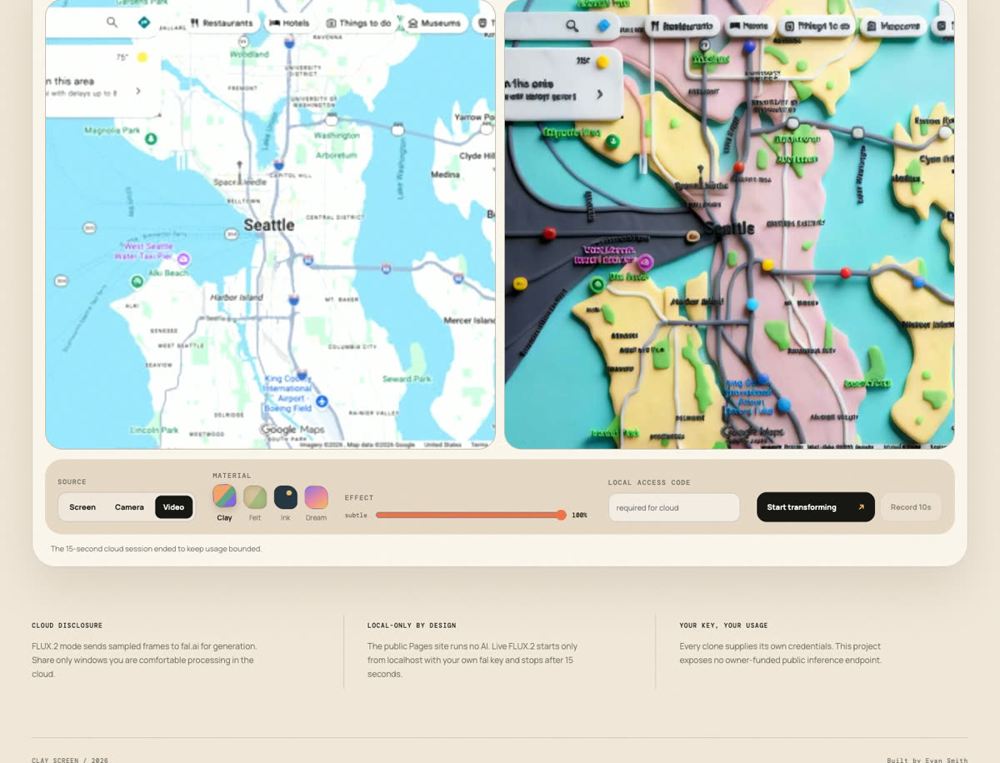

# Clay Screen

Turn a screen, camera, or video into a responsive handmade world with
[FLUX.2 [klein] Realtime](https://fal.ai/models/fal-ai/flux-2/klein/realtime).


[Interface preview](https://evnsnclr.github.io/clay-screen/) ·
[Research and build notes](RESEARCH_AND_BUILD_PLAN.md) ·
[Validation receipt](VALIDATION.md)

The GitHub Pages site is strictly an **interface preview** and never runs AI.
Real FLUX.2 generation is localhost-only: clone the repository and use your own
fal key. Clay Screen does not operate an owner-funded public inference endpoint.

## Real FLUX.2 demo

[](assets/clay-screen-demo.mp4)

Click the image to watch the actual 13-second browser capture from the bounded
release test. One Video + Clay session produced 49 generated frames before the
15-second safety cap, with a final reported round-trip of 271 ms and no browser
console errors. At the listed rate, the session's maximum estimated cost was
about $0.029.

This proves the live pipeline and the tactile clay treatment. It is not a claim
of exact parity with the inspiration: the validation source was effectively
static, small generated text is less stable, and the original demo presents a
more cohesive full-screen transformation. See the [validation receipt](VALIDATION.md)
for the direct comparison.

## Run the FLUX.2 demo locally

Requirements:

- Python 3.10 or newer
- macOS or Linux shell (the quickstart is not tested on native Windows)
- a [fal API key](https://fal.ai/dashboard/keys) with available balance
- current Chrome or Safari

```bash
git clone https://github.com/evnsnclr/clay-screen.git
cd clay-screen
python3 -m venv .venv
source .venv/bin/activate
pip install -r requirements-local.txt
cp .env.example .env.local
chmod 600 .env.local
```

Put your own key and a private local access code in `.env.local`:

```dotenv
FAL_KEY=your_api_scoped_fal_key
CLAY_SCREEN_ACCESS_CODE=choose_a_private_local_code
```

Then run:

```bash
./run_demo.sh
```

Open [http://127.0.0.1:7860](http://127.0.0.1:7860), enter the same access
code, choose **Screen**, **Camera**, or **Video**, and press
**Start transforming**. `.env.local` is ignored by Git and the fal key remains
server-side.

The access code protects the local token endpoint; it is not an account system
or a hard spending limit. A connection that produces no first frame stops after
10 seconds, and a normal FLUX.2 session stops after 15 seconds. A user or
modified client can immediately start another, so keep a small fal balance and
review the billing controls available to your account.

On July 15, 2026, fal listed this endpoint at **$0.00194 per compute-second**.
A continuously billed 15-second session would cost about **$0.029**. Check the
[current model page](https://fal.ai/models/fal-ai/flux-2/klein/realtime) before
running it.

## What leaves the device

The localhost app resizes selected browser-capture frames and sends them
directly to fal over a realtime WebSocket. fal returns generated frames for the
browser to draw and optionally record. The local FastAPI server supplies only a
short-lived, endpoint-scoped token; it does not proxy the image stream.

Treat screen sharing as disclosure to a third-party processor. Do not select a
window containing private information, and review
[fal's payload documentation](https://fal.ai/docs/documentation/model-apis/inference/payloads)
before use.

## How it works

```text
browser-approved screen, camera, or video
        │ resized JPEG frames
        ▼
fal realtime WebSocket → FLUX.2 [klein] → generated canvas
        ▲
localhost token endpoint + your own FAL_KEY
```

The browser keeps only one fresh frame in flight, uses a fixed seed and output
feedback for continuity, and closes the connection on Stop, error, page exit,
or the 15-second cap.

## Optional private Mac fallback

The existing SD-Turbo path runs entirely on an Apple Silicon Mac. It is slower
and substantially less faithful than FLUX.2, but requires no cloud key and sends
no frames off-device.

Requirements:

- Apple Silicon (M1–M4 or newer)
- macOS 14 or newer
- Python 3.10 or newer
- about 6 GB free for the one-time model download

```bash
./setup_mac.sh
./run_mac.sh
```

Open [http://127.0.0.1:7860](http://127.0.0.1:7860). The first generated frame
downloads SD-Turbo and TAESD and warms the pipeline; later launches reuse the
Hugging Face cache. The local path uses 512×288 inputs and a two-timestep
StreamDiffusion batch through PyTorch MPS. On the development Mac (`Mac16,5`,
48 GB), warm model calls took 103–136 ms; performance varies by Mac. Leave
`FAL_KEY` and `CLAY_SCREEN_ACCESS_CODE` blank when you want this path selected.

## Interface-only preview

The public GitHub Pages URL uses a labeled browser effect. It cannot mint a fal
token, never sends frames to fal, and is not presented as AI diffusion.

## Development

```bash
pip install -r requirements-dev.txt
npm ci
pytest -q
npm run check
npm test
```

These checks use mocks and never perform paid inference. The real-service gate
and one bounded paid smoke test are recorded in [VALIDATION.md](VALIDATION.md).

## Licenses and attribution

Clay Screen code is Apache-2.0 licensed. FLUX.2 mode uses the MIT-licensed,
pinned `@fal-ai/client`, fal's hosted service, and FLUX.2 [klein] from Black
Forest Labs; their terms apply separately. The optional Mac path installs
StreamDiffusion-Mac, SD-Turbo, and TAESD, whose licenses also remain separate.
See [NOTICE](NOTICE).

The visual direction was inspired by
[Ryan Stephen's realtime diffusion UI experiment](https://x.com/Ryan__Stephen/status/2066890410824528077).
Clay Screen is an independent implementation and does not reproduce the
original project's unpublished code or configuration.
